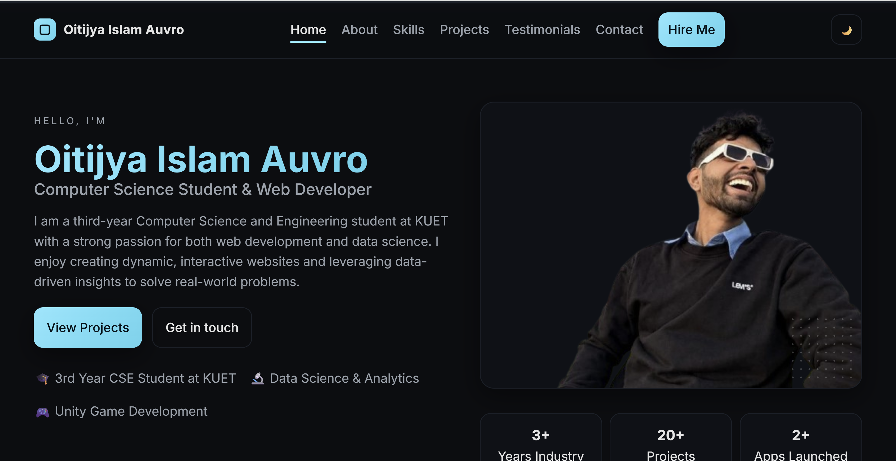
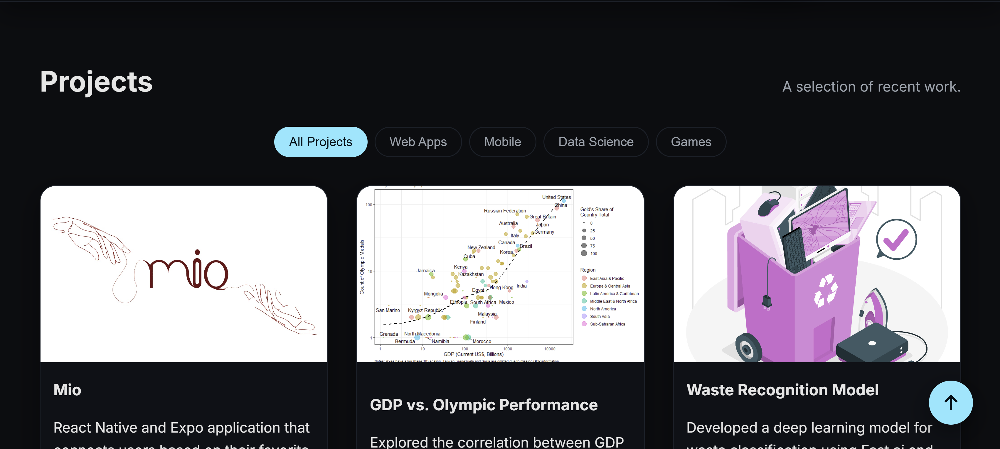
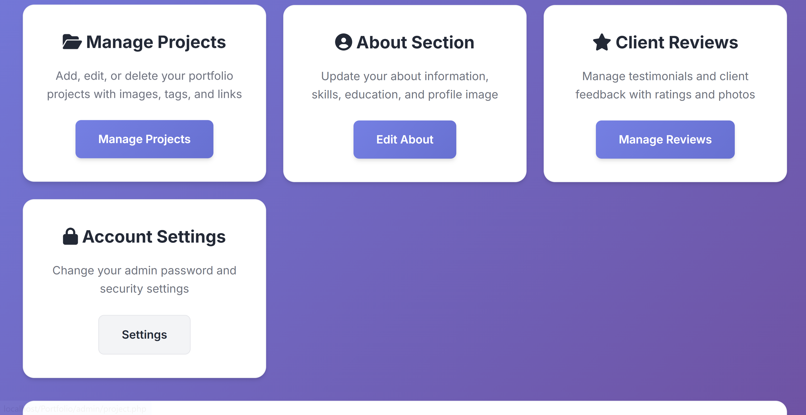

# 🚀 Professional Portfolio Website

A modern, responsive portfolio website built with PHP, MySQL, and vanilla JavaScript. Features a sleek admin panel for content management and advanced user authentication with session management.

## 📋 Table of Contents

- [✨ Features](#-features)
- [🛠️ Tech Stack](#️-tech-stack)
- [📱 Responsive Design](#-responsive-design)
- [🔐 Admin Panel](#-admin-panel)
- [🔒 Authentication & Security](#-authentication--security)
- [💾 Database Structure](#-database-structure)
- [📸 Preview](#-preview)
- [🚀 Installation](#-installation)
- [📁 Project Structure](#-project-structure)
- [🎯 Key Functionalities](#-key-functionalities)

## ✨ Features

### 🎨 Frontend Features
- **Responsive Design** - Mobile-first approach with optimized layouts for all devices
- **Modern UI/UX** - Clean, professional design with smooth animations
- **Interactive Elements** - Smooth scrolling, hover effects, and dynamic content
- **Theme Toggle** - Dark/Light mode with localStorage persistence
- **Contact Form** - Real-time validation with enhanced user feedback
- **Social Media Integration** - Direct links to GitHub, LinkedIn, and Facebook
- **Performance Optimized** - Lazy loading, optimized images, and efficient code

### 🔧 Backend Features
- **Admin Panel** - Complete content management system
- **User Authentication** - Secure login with session management
- **Remember Me** - Persistent login with secure token-based authentication
- **Database Integration** - MySQL database for dynamic content
- **CRUD Operations** - Full Create, Read, Update, Delete functionality
- **Security Features** - Password hashing, SQL injection prevention, XSS protection

## 🛠️ Tech Stack

### Frontend
- **HTML5** - Semantic markup and accessibility
- **CSS3** - Modern CSS with Grid, Flexbox, and custom properties
- **JavaScript (ES6+)** - Vanilla JS for interactivity and DOM manipulation
- **Font Awesome** - Icon library for UI elements
- **Google Fonts** - Inter font family for typography

### Backend
- **PHP 8+** - Server-side scripting and logic
- **MySQL** - Relational database management
- **Session Management** - PHP sessions for user state
- **Cookie Handling** - Secure cookie implementation for persistence

### Tools & Libraries
- **XAMPP** - Local development environment
- **Git** - Version control system
- **Responsive Design** - Mobile-first CSS approach

## 📱 Responsive Design

The website is built with a **mobile-first approach** ensuring optimal user experience across all devices:

### Key Responsive Features:
- ✅ **Fluid Grid System** - CSS Grid and Flexbox for adaptive layouts
- ✅ **Responsive Typography** - `clamp()` functions for scalable text
- ✅ **Touch-Friendly Interface** - 44px minimum touch targets
- ✅ **Mobile Navigation** - Hamburger menu with smooth animations
- ✅ **Optimized Images** - Responsive images with proper sizing
- ✅ **Breakpoint Strategy**:
  - Mobile: `< 768px`
  - Tablet: `768px - 1024px`
  - Desktop: `> 1024px`

### Accessibility Features:
- ✅ Screen reader compatibility
- ✅ Keyboard navigation support
- ✅ Focus indicators
- ✅ ARIA labels and semantic HTML
- ✅ Color contrast compliance

## 🔐 Admin Panel

A comprehensive admin dashboard for managing portfolio content:

### Admin Features:
- **🏠 Dashboard** - Overview with quick stats and navigation
- **📝 About Management** - Edit personal information and bio
- **🚀 Project Management** - Add, edit, delete portfolio projects
- **⭐ Review Management** - Manage testimonials and feedback
- **🔒 Password Management** - Secure password change functionality
- **📊 Content Analytics** - View content statistics

### Admin Panel Highlights:
- Modern, responsive design matching the frontend aesthetic
- Intuitive navigation with sidebar menu
- Form validation and error handling
- Secure file upload capabilities
- Real-time content preview

## 🔒 Authentication & Security

### Session Management
```php
// Secure session handling
session_start();
$_SESSION['admin'] = $username;
$_SESSION['admin_id'] = $user_id;
```

### Remember Me Functionality
- **Secure Token Generation** - 64-character cryptographically secure tokens
- **Database Token Storage** - Tokens stored securely in database
- **Automatic Expiration** - 30-day expiration with cleanup
- **HttpOnly Cookies** - XSS protection through cookie settings

```php
// Remember me implementation
$token = bin2hex(random_bytes(32));
setcookie('remember_admin', $token, time() + (30 * 24 * 60 * 60), '/', '', false, true);
```

### Security Features:
- ✅ **Password Hashing** - PHP `password_hash()` and `password_verify()`
- ✅ **SQL Injection Prevention** - Prepared statements throughout
- ✅ **XSS Protection** - Input sanitization and output escaping
- ✅ **CSRF Protection** - Session-based request validation
- ✅ **Secure Headers** - HttpOnly and Secure cookie flags

## 💾 Database Structure

### Tables Overview:

#### 1. `admins` Table
```sql
- id (Primary Key)
- username (Unique)
- password (Hashed)
- remember_token (Nullable)
- remember_token_created (Timestamp)
- created_at (Timestamp)
```

#### 2. `about` Table
```sql
- id (Primary Key)
- name
- title
- description
- profile_image
- updated_at (Timestamp)
```

#### 3. `projects` Table
```sql
- id (Primary Key)
- title
- description
- image
- technologies
- github_link
- live_link
- created_at (Timestamp)
```

#### 4. `reviews` Table
```sql
- id (Primary Key)
- name
- position
- company
- review_text
- rating
- image
- created_at (Timestamp)
```

## 📸 Preview

### 🌐 Frontend Website

*Homepage with hero section and responsive navigation*


*Skills section and portfolio projects showcase*

### 🔧 Admin Panel

*Modern admin dashboard with content management*

## 🚀 Installation

### Prerequisites
- XAMPP (Apache + MySQL + PHP)
- Web browser
- Text editor/IDE

### Setup Steps

1. **Clone the Repository**
```bash
git clone https://github.com/AuvroIslam/Portfolio.git
cd Portfolio
```

2. **Move to XAMPP Directory**
```bash
# Move project to XAMPP htdocs
cp -r Portfolio /xampp/htdocs/
```

3. **Database Setup**
```sql
-- Create database
CREATE DATABASE portfolio;

-- Import tables (run SQL commands for each table)
USE portfolio;
```

4. **Configure Database Connection**
```php
// Update database credentials in all PHP files
$conn = new mysqli("localhost", "root", "", "portfolio");
```

5. **Start XAMPP Services**
- Start Apache Server
- Start MySQL Database

6. **Create Admin User**
```bash
# Run the seed file to create admin user
http://localhost/Portfolio/admin/seed_admin.php
```

7. **Access the Application**
- **Frontend**: `http://localhost/Portfolio/`
- **Admin Panel**: `http://localhost/Portfolio/admin/`

## 📁 Project Structure

```
Portfolio/
├── admin/                      # Admin panel files
│   ├── admin-styles.css       # Admin panel styles
│   ├── dashboard.php          # Admin dashboard
│   ├── login.php              # Admin login
│   ├── logout.php             # Admin logout
│   ├── about.php              # About management
│   ├── project.php            # Project management
│   ├── review.php             # Review management
│   ├── change_password.php    # Password management
│   └── seed_admin.php         # Admin user creation
├── assets/                     # Image assets
│   ├── profile_pic.png        # Profile image
│   ├── about_pic.jpg          # About section image
│   └── ...                    # Other project images
├── preview/                    # Preview images
│   ├── preview1.png           # Website preview 1
│   ├── preview2.png           # Website preview 2
│   └── preview3.png           # Admin panel preview
├── index.php                   # Main homepage
├── styles.css                  # Frontend styles
├── app.js                      # Frontend JavaScript
├── LICENSE                     # MIT License
└── README.md                   # This file
```

## 🎯 Key Functionalities

### 🎨 Frontend Functionalities
| Feature | Description | Implementation |
|---------|-------------|----------------|
| **Responsive Design** | Mobile-first responsive layout | CSS Grid, Flexbox, Media Queries |
| **Interactive Navigation** | Smooth scrolling, active states | Vanilla JavaScript |
| **Theme Toggle** | Dark/Light mode switching | CSS Custom Properties + localStorage |
| **Contact Form** | Real-time validation, email integration | JavaScript validation + Formspree |
| **Lazy Loading** | Performance optimization | Intersection Observer API |
| **Smooth Animations** | Scroll-triggered animations | CSS Transitions + JavaScript |

### 🔧 Backend Functionalities
| Feature | Description | Implementation |
|---------|-------------|----------------|
| **User Authentication** | Secure login/logout system | PHP Sessions + Password Hashing |
| **Remember Me** | Persistent login functionality | Secure tokens + Cookies |
| **Content Management** | CRUD operations for all content | PHP + MySQL |
| **File Upload** | Secure image upload handling | PHP file validation |
| **Session Security** | Protected admin routes | Session validation middleware |
| **Database Security** | SQL injection prevention | Prepared statements |

### 🔒 Security Implementations
- **Password Security**: bcrypt hashing with salt
- **Session Management**: Secure session handling with regeneration
- **Cookie Security**: HttpOnly, Secure flags, and SameSite attributes
- **Input Validation**: Server-side validation and sanitization
- **Output Encoding**: XSS prevention through proper escaping
- **Token Management**: Cryptographically secure random tokens

---

## 👨‍💻 Developer

**Oitijya Islam Auvro**
- 🎓 Computer Science & Engineering Student at KUET
- 🌐 Web Developer & Data Science Enthusiast
- 🎮 Unity Game Developer

### Connect with me:
- **GitHub**: [@AuvroIslam](https://github.com/AuvroIslam)
- **LinkedIn**: [Oitijya Islam Auvro](https://www.linkedin.com/in/oitijya-islam-auvro-a252a5325)
- **Facebook**: [Oitijya Islam Auvro](https://www.facebook.com/oitijya.islam.auvro)

---

## 📄 License

This project is licensed under the MIT License - see the [LICENSE](LICENSE) file for details.

---

## 🤝 Contributing

Contributions, issues, and feature requests are welcome! Feel free to check the [issues page](https://github.com/AuvroIslam/Portfolio/issues).

---

⭐ **Star this repository if you found it helpful!**